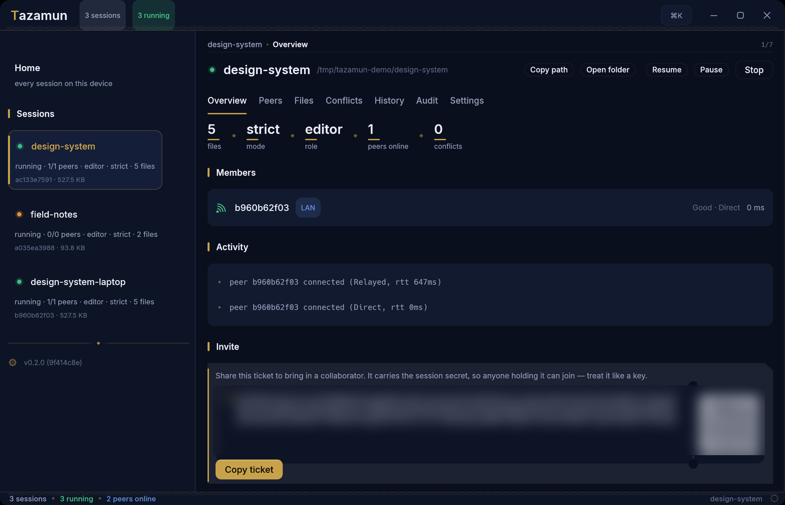
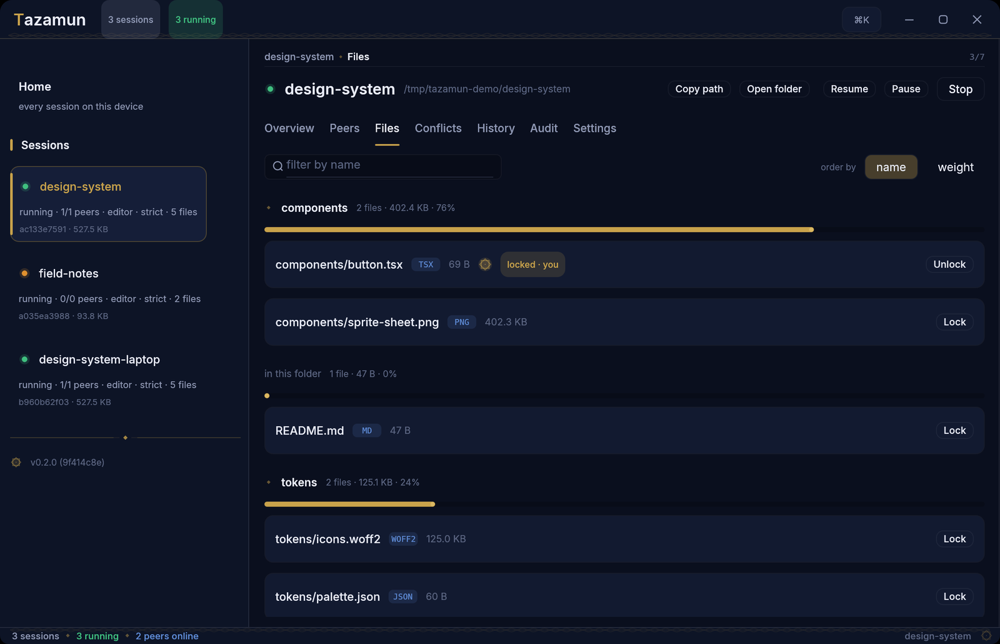
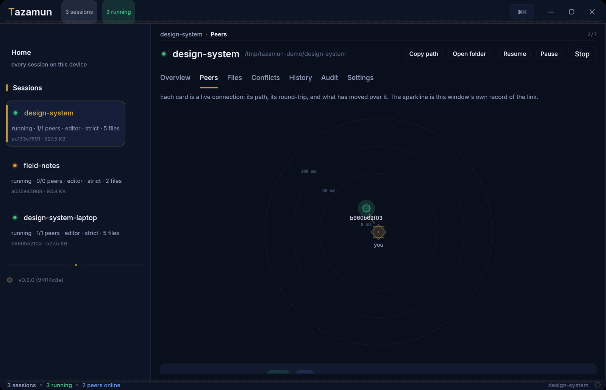
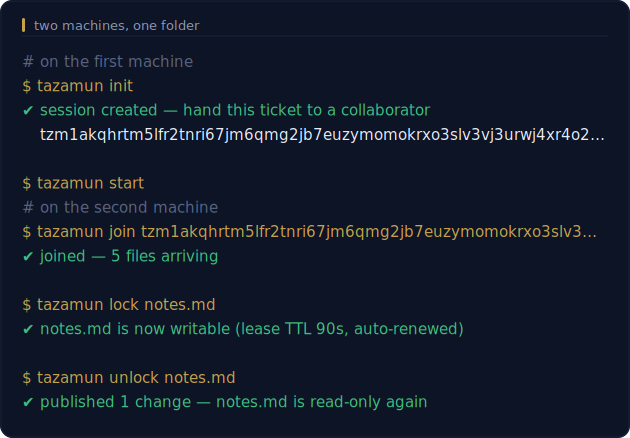
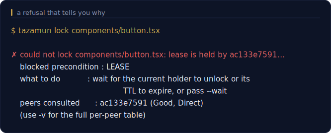
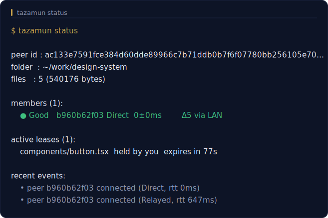

<div align="center">


# Tazamun

**A shared folder with a lock on every file — synced machine to machine, readable by nothing in between.**

[](LICENSE)
[](https://www.rust-lang.org)
[](src/lib.rs)
[](https://github.com/cc1a2b/tazamun/releases)
[](https://github.com/cc1a2b/tazamun/stargazers)
[](https://github.com/cc1a2b/tazamun/releases)


</div>

---

Dropbox hands your files to a server. Git makes you think in commits, branches, and merges. **tazamun does neither.**

It keeps a plain folder — documents, PSDs, game assets, raw binaries, anything — in lockstep across machines over an encrypted peer-to-peer link, and it borrows version control's oldest idea to keep collaborators from trampling each other: **to change a file, you check it out.** While you hold the lease it's writable and yours alone; everyone else sees it read-only. Put it back and the new bytes land everywhere. No merge conflicts you didn't cause, no port forwarding, and no relay or cloud that can read a single byte of what you sync.

Two people behind two different NATs connect with nothing but an invite string. [iroh](https://iroh.computer) punches a direct, authenticated QUIC path between them and only falls back to an **end-to-end-encrypted** relay when the network leaves it no choice. The relay forwards sealed packets; it cannot open them.

```text
   you ──lock──▶   ┌──────────────┐       QUIC        ┌──────────────┐
  edit in place    │   tazamun    │◀═════════════════▶│   tazamun    │
   unlock ──────▶  │    peer A    │   e2e-encrypted   │    peer B    │
                   └──────┬───────┘                   └──────┬───────┘
                          └──────────────────────────────────┘
                            optional relay · forwards ciphertext only,
                            and can never open what it forwards
```

> **Status — v0.1.0.** The sync engine, the CLI, the loopback dashboard and the native desktop app are all built and gate-clean: `fmt`, `clippy -D warnings`, and the full test suite pass on every commit. Every load-bearing decision — with the reasoning, including the ones that turned out to be wrong — is written down in [DECISIONS.md](DECISIONS.md).

---

## Contents

- [The whole idea](#the-whole-idea)
- [See it](#see-it)
- [Where it sits](#where-it-sits)
- [A glimpse](#a-glimpse)
- [Rules it will not break](#rules-it-will-not-break)
- [Install](#install)
- [Two minutes to first sync](#two-minutes-to-first-sync)
- [Everyday commands](#everyday-commands)
- [Home & the session manager](#home--the-session-manager)
- [One daemon, many folders](#one-daemon-many-folders)
- [Strict vs. easy mode](#strict-vs-easy-mode)
- [How it actually works](#how-it-actually-works)
- [Threat model](#threat-model)
- [Knowing your connection](#knowing-your-connection)
- [The web dashboard](#the-web-dashboard)
- [The desktop GUI](#the-desktop-gui)
- [Staying sovereign](#staying-sovereign)
- [Operating it](#operating-it)
- [Build & hack](#build--hack)
- [License](#license)

---

## The whole idea

Three commitments, and everything else follows from them:

**One writer at a time.** A synced file is read-only on disk. Editing means taking an exclusive, network-granted *lease* — so two people can never quietly overwrite each other. This is checkout, not merge.

**Nobody in the middle can read it.** Content is chunked, BLAKE3-addressed, and streamed over authenticated, encrypted QUIC. Relays only ever forward opaque bytes. Even presence beacons — who's online, at which address — are sealed under the session key. Knowing the gossip topic gets you nowhere; every control link proves knowledge of the session secret, both directions, before a single message is read.

**Your bytes are never silently lost.** This is the load-bearing promise, enforced everywhere:

> **The Golden Invariant** — never overwrite data a peer has not seen; never silently delete user bytes. Every ambiguous situation resolves the same way: *preserve both copies, warn loudly.*

A forced write to a locked file isn't rejected into the void — it's copied to a quarantine and the indexed version is restored. A failed transfer touches nothing. A version-vector clash keeps both sides. Nothing is ever `rm`'d out from under you.

---

## See it

Everything below is a real screenshot of a real session — two folders on one
machine, peered over the LAN, with a lease actually held. Nothing is a mockup.

<div align="center">



</div>

**One session, at a glance.** Files, mode, role, peers online and conflicts across
the top; every member with its grade, path and round-trip; the activity feed showing
this peer arriving *relayed at 647 ms* and then upgrading to a *direct 0 ms* path —
hole-punching, visible as it happens. The invite is generated in-process as text and
as a scannable QR. (Blurred here on purpose: **a ticket carries the session secret.**)

<table>
<tr>
<td width="50%"></td>
<td width="50%"></td>
</tr>
<tr>
<td valign="top">

**Files.** Grouped by folder, each group carrying a bar for its share of the
session's bytes, so you can see what is actually heavy. `button.tsx` is checked
out — sealed, marked <b>locked · you</b>, and the button offers <b>Unlock</b>.
Every other file shows <b>Lock</b>, because every other file is read-only on disk.

</td>
<td valign="top">

**Peers.** A mesh is a shape, not a list — the questions are spatial. You are the
centre; each peer is a star on a log round-trip scale, with hairline rings at the
80 ms and 300 ms grade thresholds. A **taut woven band** means a direct path; a
broken thread means relayed. Angles come from a hash of the peer id, so the sky
never shimmers between refreshes.

</td>
</tr>
</table>

### And the same thing without a window

The CLI is not a lesser sibling — it is the same daemon, the same guarantees, and
it is what the app talks to.

<div align="center">



</div>

When a lease is refused, you are told **which precondition failed, who was
consulted, and what to do about it** — never a bare "denied":

<div align="center">



</div>

And `tazamun status` is the habit the whole tool is built around — *check your
connection before you edit*:

<div align="center">



</div>

---

## Where it sits

tazamun isn't trying to be Dropbox, Git, or Syncthing — it takes a different corner of the design space on purpose:

| | tazamun | Syncthing | Dropbox / cloud | git-annex |
| --- | --- | --- | --- | --- |
| **Conflict model** | exclusive checkout — one writer, no clobber | last-writer-wins + conflict copies | last-writer-wins + conflict copies | manual, commit-based |
| **Server trust** | none — E2E; relays see ciphertext | none | full — provider holds plaintext | depends on remote |
| **Across NAT** | hole-punch + E2E relay fallback | yes | via provider | via remote |
| **File types** | anything (binaries, PSDs, assets) | anything | anything | anything |
| **Mental model** | *check the file out* | everything, everywhere, eventually | a magic folder | git for big files |
| **Onboarding** | one invite string | trade device IDs | an account | git-remote plumbing |

If you want every device to converge *eventually* and don't mind conflict copies, Syncthing is excellent. If you want a coordination **guarantee** — that two people can't both be editing `logo.psd` at this moment — that's the gap tazamun exists to fill.

---

## A glimpse

`tazamun status` is the whole point made legible: **check your connection before you edit.** It grades every peer and shows what's leased or moving.

```text
peer id : 7b3f2a9c1d8e4f60a5b2c7d9e0f1a2b3c4d5e6f708192a3b4c5d6e7f80912a3b4
folder  : ~/work/design-system
files   : 128 (94371840 bytes)

members (2):
  ● Good   9f2c4a7e10 Direct  24±3ms       Δ0
  ● Fair   3d8b1f60ca Relayed 118±9ms      Δ1 via euw-1.relay.n0.iroh.link  ↓1.2 ↑0.0 MB/s

active leases (1):
  designs/logo.psd  held by 9f2c4a7e10  expires in 74s

transfers (1):
  ⇣ src/render/pipeline.rs   62%  8.4 MB/s

recent events:
  • peer 3d8b1f60ca upgraded Relayed→Direct (rtt 34ms)
```

Add `--watch` for a one-second live panel, or `--json` for the stable machine snapshot every GUI and script can build on.

---

## Rules it will not break

A lease is granted only when **all three** preconditions hold — checked fresh on every request, computed identically on every node:

| Precondition | Meaning |
| --- | --- |
| **Reachability** | ≥ 1 authenticated peer is connected, and *every* connected peer grants the request. |
| **Freshness** | your version vector for the path is up to date against every peer, and nothing newer is still being pulled. |
| **Lease** | no active, unexpired lease already exists on the path. |

Races resolve deterministically on the total order `(lamport, endpoint-id)` — first-to-ask does not win, *lowest-ordered* does, and everyone agrees on who that is. Leases carry a TTL and auto-renew while held, so a peer that crashes mid-edit never freezes a file forever.

What that buys you, and what it deliberately doesn't:

| Guaranteed | Explicitly not |
| --- | --- |
| No two peers write the same path at once | Not a backup — history is the last 5 versions, kept locally |
| No silent overwrite; the loser is quarantined | Not a merge tool — it never blends two edits into one |
| No plaintext ever leaves your machines | Not offline-editable in strict mode (no peer → no lease) |
| Interrupted transfers touch your folder not at all | Not a filesystem — it syncs a folder, not block devices |

> tazamun is **strict by design.** With zero connected peers, every edit path — lock, restore, new file — is refused, because with no one to coordinate with there is no safe way to honor the Golden Invariant. If that's too strict for how you work, see [easy mode](#strict-vs-easy-mode).

---

## Install

Pick whichever tool you already live in — every route below delivers the same
single, self-contained binary. Nothing else is installed: no runtime, no
services, no browser engine. The binary carries its own fonts, icon, man page
and shell completions.

**One line** (Linux and macOS):

```bash
curl --proto '=https' --tlsv1.2 -LsSf https://github.com/cc1a2b/tazamun/releases/latest/download/tazamun-installer.sh | sh
```

**One line** (Windows PowerShell):

```powershell
powershell -ExecutionPolicy Bypass -c "irm https://github.com/cc1a2b/tazamun/releases/latest/download/tazamun-installer.ps1 | iex"
```

**Homebrew** (macOS and Linux):

```bash
brew install cc1a2b/tap/tazamun
```

**npm** — useful when a JS toolchain is what a team already has:

```bash
npm install -g tazamun
```

Recent npm versions may warn that tazamun has an install script "not yet
covered by allowScripts" — that script downloads the platform binary at
install time, and npm's new supply-chain guard flags every package that has
one. Harmless either way: if npm blocked it, the first `tazamun` run fetches
the binary itself. To keep the warning quiet:
`npm config set allow-scripts=tazamun --location=user`.

**Cargo** — builds from the published crate with your own toolchain:

```bash
cargo install tazamun            # from crates.io
cargo install --git https://github.com/cc1a2b/tazamun   # straight from main
```

**By hand** — grab the archive for your platform from
[Releases](https://github.com/cc1a2b/tazamun/releases), unpack, and put
`tazamun` somewhere on your `PATH`. Builds ship for
x86_64 Linux, Intel and Apple-silicon macOS, and x86_64 Windows.

Every release artifact carries a `.sha256` checksum and a SLSA build-provenance
attestation — proof the binary was built by this repository's release workflow
from a public commit, not on somebody's laptop:

```bash
sha256sum -c tazamun-x86_64-unknown-linux-gnu.tar.gz.sha256
gh attestation verify tazamun-x86_64-unknown-linux-gnu.tar.gz --repo cc1a2b/tazamun
```

**From source** — the whole project is one `cargo build`:

```bash
git clone https://github.com/cc1a2b/tazamun && cd tazamun
cargo build --release            # → target/release/tazamun
```

Requires the Rust stable toolchain (edition 2024, MSRV **1.91**).

### Staying current

The binary updates itself — it finds the release for this platform, verifies it
is newer, downloads, and swaps itself in place:

```bash
tazamun update --check           # is a newer build out?
tazamun update                   # fetch and self-replace
```

If a package manager put tazamun on your machine, let it do the updating
instead, so its records stay true: `brew upgrade tazamun`,
`npm update -g tazamun`, or `cargo install tazamun` again.

> **WSL users:** keep your session folder on the **native Linux filesystem**
> (`~/projects/…`), not a `/mnt/c` or `/mnt/e` Windows mount. Those mounts
> speak 9p — no Unix sockets, no reliable change events — so the daemon can't
> run there. To sync a Windows drive, run the native Windows build as its own
> peer and let the two nodes sync over the network, not across the mount.

---

## Two minutes to first sync

Two machines. **Hussain** shares, **cc1a2b** joins.

```bash
# ── Hussain ──────────────────────────────────────────
mkdir project && cd project
tazamun init                 # prints a peer id + an invite ticket (tzm1…)
tazamun start                # foreground daemon — leave it running

tazamun invite               # (second shell) a fresh ticket with live addresses → send to cc1a2b

# ── cc1a2b ───────────────────────────────────────────
mkdir project && cd project
tazamun join tzm1…           # paste Hussain's ticket into an EMPTY folder
tazamun start

# ── Either side edits ────────────────────────────────
tazamun lock report.md       # take the lease → the file becomes writable
$EDITOR report.md
tazamun unlock report.md     # publish + release → syncs everywhere, back to read-only
```

That's the entire loop: `init → invite → join → start → lock · edit · unlock`.

---

## Everyday commands

```bash
tazamun                            # no command → Home: a greeting + every session on this device
tazamun sessions                   # manage them all: open, copy invite, remove
tazamun ls                         # every session at a glance: running/paused, files, peers, pending
tazamun init                       # make this folder a new session
tazamun join tzm1qy…               # join someone's session (folder must be empty)
tazamun start                      # run the daemon in the foreground (Ctrl-C stops cleanly)
tazamun start --all                # one process hosts EVERY registered folder (the supervisor)
tazamun pause  --dir ~/work/proj   # stop syncing one folder (stays registered; nothing deleted)
tazamun resume --dir ~/work/proj   # bring it back (live, under a running supervisor)

tazamun status                     # who's connected, how (Direct/Relayed), what's locked
tazamun status --watch             # live one-second panel
tazamun invite --qr                # a fresh ticket, rendered as a scannable QR
tazamun invite --role viewer --ttl 24h  # a signed read-only invite that expires in a day
tazamun peers                      # list this session's peers (with any names you've given)
tazamun peers name 9f2c4a7e "nas"  # label a peer (id may be a short prefix)
tazamun rekey                      # revoke: rotate the session key + re-invite whom you keep

tazamun lock  assets/logo.png      # check out → edit → check in
tazamun unlock assets/logo.png
tazamun lock  report.md --wait     # queue on a busy file; auto-acquire when it frees

tazamun versions assets/logo.png   # kept history — with tags, pins, disk usage
tazamun restore  assets/logo.png 1 # roll back (under a lease)
tazamun tag  report.md 1 approved  # name a version · pin it so it's never pruned
tazamun pin  report.md 1
tazamun diff report.md 2           # chunk-aware compare vs a kept version

tazamun conflicts                  # list quarantined copies (path · why · age · size)
tazamun conflicts resolve <id> --keep mine|theirs|both   # resolve one, explicitly

tazamun log                        # the audit trail: who locked/published/… what, when
tazamun log --path report.md --follow   # filter to one file and tail it live

tazamun setup                      # interactive settings panel: role, strict/easy, network, presets
tazamun doctor                     # one-shot NAT + filesystem + relay health report
tazamun dashboard                  # start the local web panel and open it

tazamun send report.pdf            # one-shot transfer, no session: prints a tzs1… ticket
tazamun receive tzs1…              # …the other machine runs this to pull it

tazamun --dir ~/work/proj status   # operate on a folder other than the cwd
```

The four network flags — `--relay`, `--no-relay`, `--no-lan`, `--airgap` — are **global**: on `start` they override the persisted config for that run; precedence is always **flag → persisted config → default**.

---

## Home & the session manager

Run `tazamun` with no command and you land on **Home** — a greeting by the time
of day and your OS user, then a live overview of every session on the machine:

```text
  Good evening, Hussain
  tazamun 0.1.0

  3 session(s) on this device · 1 running
    ● ~/work/design-team     running · 128 files
    ○ ~/work/contracts       stopped · 12 files
    ○ /mnt/media/renders            stopped · 40 files

  → manage them:  tazamun sessions
```

`tazamun sessions` opens the device-wide manager: an arrow-key list of every
session with per-item actions — **copy its invite** (rebuilt from the folder,
best-effort to your clipboard), open its **dashboard**, jump into its
per-folder **setup**, and **remove** it. Removal forgets the session from the
device and only deletes tazamun's `.tazamun` metadata on an explicit second
confirm — **your files are never deleted.** The device list lives in one small
`sessions.json` under the OS config dir (`%APPDATA%` / `~/Library/Application
Support` / `~/.config`), is written by `init`/`join`, and self-heals by dropping
folders that are gone. On a pipe or non-TTY, Home and `sessions` print a plain
overview — identical over SSH and on every OS.

## One daemon, many folders

If you sync several folders, you don't need one daemon process per folder.
`tazamun start --all` is the **supervisor**: a single process that hosts every
registered, non-paused folder at once — one daemon actor per session, each still
the sole writer for its own folder. Nothing else changes: every hosted session
keeps its own control socket, so `tazamun --dir <folder> status | lock | …` and
its dashboard all work exactly as before. The supervisor is purely additive.

```bash
tazamun start --all                # host every folder in one process
tazamun ls                         # the device-wide table
```

```text
3 session(s) · 2 running · 1 paused · supervisor up
  ● ~/work/design-team   running · 128 files · peers 2/3 · 1 pulling [supervised]
  ● ~/work/contracts     running · 12 files · peers 0/1            [supervised]
  ⏸ /mnt/media/renders          paused
```

A single **device-global control socket** carries the commands a per-folder
socket can't — pause, resume, list — so you can suspend one folder live without
disturbing the others:

```bash
tazamun pause  --dir /mnt/media/renders   # graceful stop; stays registered, nothing deleted
tazamun resume --dir /mnt/media/renders   # back up immediately under the supervisor
```

Pausing gracefully shuts that one session down (its leases released) and records
a flag that survives restarts; `start --all` skips paused folders until you
resume them. With no supervisor running, `pause`/`resume` simply set that flag
and `ls` still works by scanning each folder directly.

**One service for everything.** `tazamun service install --all` installs a
single device-wide autostart unit (systemd `tazamun-supervisor`, a launchd
agent, or a Windows scheduled task) that runs `start --all`, instead of one unit
per folder. The per-folder `service install` is still there for isolated units.
To migrate, install the supervisor service, then `tazamun --dir <folder> service
uninstall` each old per-folder unit.

Two deliberate limits, stated plainly: each hosted session keeps its **own**
network endpoint (correct session-key isolation over a shared one), and each
folder's web dashboard is still opened per-folder — a single dashboard with a
folder switcher is a later phase.

## Strict vs. easy mode

By default tazamun is strict: read-only files, explicit `lock`/`unlock`. That's exactly right for a team that must never step on each other. For solo work or a trusted pair it can be friction, so there's a switch:

```bash
tazamun config set strict off      # "easy mode" (restart the daemon to apply)
```

In easy mode, files stay **writable** and an un-leased edit — or a brand-new file you drop in — **auto-acquires a lease and publishes itself**, so you just save in your editor and it syncs. The safety net is unchanged: two people editing the same path at the same instant still resolve to one winner, and the loser's bytes are quarantined, never overwritten. You trade the *one-writer-at-a-time guarantee* for edit-in-place convenience — nothing else. Flip `strict on` and restart to get the guarantee back.

There's also **autolock** (`config set autolock on`), a middle ground that keeps files read-only but auto-takes the lease on your first write to a *free* path. See [`tazamun config`](#operating-it) for the full matrix.

Orthogonal to all of that is the folder's **role**. An `editor` (the default) has full rights. A `viewer` syncs and reads everything but can **never** lock, edit, or publish — its own daemon refuses every edit path, online or offline; use it for mirrors, kiosks, or a machine that should only receive. An `archive` is a viewer that keeps a much deeper version history (25 versions per path instead of 5) — a passive session historian. Set it per folder:

```bash
tazamun config set role viewer     # or: editor · archive (restart to apply)
```

### Roles that hold on the wire, and expiring invites

A local `config set role` is a promise a folder makes about *itself*. What if the other end runs a patched binary that ignores its own viewer role and tries to lock anyway? tazamun binds the role into the **invite**, cryptographically, so an honest peer refuses it regardless of what the other end's binary does:

```bash
tazamun invite --role viewer            # a read-only invite
tazamun invite --role viewer --ttl 24h  # …that also expires in a day
tazamun invite                          # a full editor invite (the default)
```

Under the hood, a session created with this build has an Ed25519 **admin keypair** alongside the shared secret. Every invite carries a role **grant signed by the admin key**. Editor invites include the admin secret (editors are co-admins who can invite in turn); viewer and archive invites include only the admin *public* key — so a viewer physically cannot sign an editor grant. When peers connect, each presents its grant; the other verifies the signature and records the role. A grantor then **refuses a lease to any non-editor** — the check runs on the granting side, before the lock logic, so a modified viewer that skips its own check and sends a raw lock request is still denied. `--ttl` signs an expiry into the grant: an expired invite confers nothing and is refused at join. (Sessions created before this feature carry no admin key and enforce nothing, exactly as before.)

### Revoking a member: `tazamun rekey`

In a shared-secret mesh there is only one honest way to remove someone: change the secret and re-invite everyone you keep. `tazamun rekey` does exactly that in one step. Stop the daemon, then:

```bash
tazamun rekey                       # rotates the session key + admin key, prints a new invite
# → hand the new invite to each member you keep; on their machine:
tazamun rekey --accept tzm1…        # swaps the key in place — files and history untouched
# → everyone runs `tazamun start` again
```

The rotation keeps each node's **endpoint identity** (only the session secret and admin key change), so the mesh re-forms over the new gossip topic just like a fresh join. The member you did **not** re-invite is left on the old key: their handshake no longer matches, so they simply can't connect. Nothing is deleted, and `rekey` refuses to run while the daemon is up (it's rotating the cryptographic root) or on a pre-roles session (there's nothing to rotate).

### Naming peers

Peer ids are 64 hex characters. Give the ones you care about a name and they show up that way everywhere:

```bash
tazamun peers                       # list peers: online dot, name-or-id, connection, health
tazamun peers name 9f2c4a7e "nas"   # the id can be any unambiguous prefix
tazamun peers rm 9f2c4a7e           # back to the hex
```

Names are **local** — they live in this node's state, never travel on the wire, and are never trusted for anything. They're purely so `status`, `locks`, `peers`, and the dashboard read `nas` instead of `9f2c4a7e10…`.

The friendliest way to drive all of these is **`tazamun setup`** — a full-screen terminal panel (arrow keys, grouped settings, `/` to search) where every change is previewed before it saves, with one-keystroke presets: `team-strict`, `solo-easy`, `viewer-kiosk`, `lan-only`. A fresh `tazamun init` on a terminal offers the same choices as a three-question wizard — Enter three times keeps every default.

---

## How it actually works

**Control plane.** Peers rendezvous over an encrypted gossip topic derived from the session secret, then open authenticated QUIC control connections that carry the index-exchange, lease, and metadata protocol. The membership layer keeps a full mesh of these connections alive with exponential-backoff redial, so a dropped link heals itself. A large folder's connect-time index is split across as many frames as it needs and reassembled on the other side (committed only once complete), so folders with 100k+ files sync without a hiccup.

**Data plane.** Files are split with **FastCDC** content-defined chunking; each chunk is BLAKE3-hashed and kept in a local [iroh-blobs](https://iroh.computer) store. Syncing a change fetches only the chunks the receiver lacks — a one-line edit in a 2 GB file moves a few kilobytes. Every chunk is verified on arrival, the file is assembled in a staging path, fsynced, and swapped in by **atomic rename**. Interrupt it and your folder is exactly as it was.

**The single-writer core.** All state — the index, the lease table, membership — is mutated in exactly one place: a single actor task. There is no shared-mutable-state locking to get wrong; the lock state machine and the untrusted-path sanitizer are pure and exhaustively unit-tested. `#![forbid(unsafe_code)]` at the crate root, and no `.unwrap()` in production paths that aren't provably infallible.

The crate is small and sharply separated — each module owns exactly one invariant:

| Module | Owns |
| --- | --- |
| `sync/vclock` · `sync/index` | pure version-vector algebra; the *only* untrusted-path sanitizer |
| `sync/chunker` · `sync/transfer` | FastCDC cut points; the iroh-blobs store, staging, GC-protection |
| `locks` | the pure lease state machine — injected clock, zero I/O |
| `guard` | read-only enforcement + quarantine (never deletes) |
| `net/*` | iroh endpoint, mutual proof-of-secret handshake, encrypted membership gossip |
| `daemon` | the single state-owning actor — every mutation lands here |

A full `lock → edit → unlock` round trip between peers **A** and **B**:

```text
1  A: lock report.md   →  LockReq(lamport) broadcast; EVERY connected peer must grant
2  B:                  →  LockGrant   (freshness + no-active-lease re-checked on receipt)
3  A: report.md is writable — you edit and save
4  A: unlock report.md →  only changed chunks are re-hashed and published as FileMeta
5  B:                  →  pulls just the missing chunks, verifies each against its hash
6  B:                     stage · fsync · atomic-rename → report.md appears, read-only
7  A: lease released → report.md read-only again; B is now free to lock it
```

---

## Threat model

**Assumes:** the session secret stays secret — it is the root of trust, so treat a `tzm1…` ticket like an SSH key; your own machine and OS are not compromised; and iroh's QUIC/TLS plus the vetted crypto crates (BLAKE3, XChaCha20-Poly1305, HKDF) hold.

**Defends against:**

| Threat | Mechanism |
| --- | --- |
| A relay or network observer reading files | content is end-to-end encrypted; relays forward ciphertext only |
| An eavesdropper learning who/where peers are | presence beacons are XChaCha20-Poly1305 sealed under the session key |
| An outsider who learned the gossip topic | mutual proof-of-secret handshake, both directions, before any message is read |
| A member forging paths or flooding huge frames | one untrusted-path sanitizer; frames length-bounded, rejected past 4 MiB |
| A chunk tampered with in transit | every chunk verified against its BLAKE3 hash on arrival |
| A local web page attacking the dashboard | loopback-only, on-demand, fragment token, Host allow-list, strict CSP |

**Does _not_ defend against:** a compromised endpoint (tazamun trusts its own process and disk); a peer you invited acting in bad faith *inside* the session — checkout stops accidental clobber, not a determined insider; or traffic-analysis of packet timing and size on the relay path.

Signing is groundwork today — build-provenance attestations ship on every release artifact; Authenticode / Developer-ID notarization is a documented, post-v0.1 purchase ([docs/SIGNING.md](docs/SIGNING.md)).

---

## Knowing your connection

Every member row reads: **grade dot** · grade · id · connection type · `rtt±jitter` · path-change count (`Δ`) · relay host when relayed · live throughput.

| Grade | Meaning |
| --- | --- |
| **Good** | Direct path, RTT < 80 ms, jitter < 20 ms |
| **Fair** | stable Relayed, or Direct with elevated RTT/jitter |
| **Poor** | flapping (> 3 path changes/min), RTT ≥ 300 ms, or a presence gap on a live link |
| **Offline** | no connection, nothing heard in 30 s |

When a lock is refused, tazamun tells you **which precondition failed, which peers it consulted with their grades, and what to do** — never a bare "denied":

```console
$ tazamun lock report.md
could not lock report.md: peer 3d8b1f60ca disconnected while voting on the lease
  blocked precondition : REACHABILITY
  what to do           : the peer whose grant was required went offline — retry once it reconnects
  peers consulted      : 3d8b1f60ca (Offline, None)
  (use -v for the full per-peer table)
```

`tazamun doctor` is the environment counterpart — identity and bound sockets, relay reachability, per-peer hole-punch status, filesystem sanity (watcher backend, native-FS vs. WSL warning, a live read-only-enforcement probe), and IPC health — each with an `OK` / `WARN` / `FAIL` verdict, an actionable line, and an exit code (`0`/`1`/`2`). `--json` on both for machine output.

<details>
<summary><b>The <code>status --json</code> schema (v1)</b></summary>

```json
{
  "schema": 1,
  "id": "<64-hex endpoint id>",
  "dir": "<absolute path>",
  "members": [
    {
      "id": "<hex>", "online": true, "synced": true,
      "conn": "Direct|Relayed|None",
      "grade": "Good|Fair|Poor|Offline",
      "rtt_ms": 24.0, "rtt_jitter_ms": 3.1,
      "path_changes": 0, "flaps_per_min": 0,
      "relay_url": null,
      "rate_rx_bps": 0.0, "rate_tx_bps": 0.0,
      "bytes_rx": 0, "bytes_tx": 0,
      "time_to_direct_ms": 42
    }
  ],
  "leases": [ { "path": "...", "holder": "<hex>", "mine": false, "expires_in_ms": 74000 } ],
  "pending_pulls": [ { "path": "...", "percent": 62, "bytes_done": 0, "bytes_total": 0, "rate_bytes_per_sec": 0 } ],
  "transfer": { "download_limit_bps": 0, "backlog": 0, "resuming": 0, "swarm_peers": 4 },
  "events": [ { "seq": 7, "text": "peer 3d8b1f60ca upgraded Relayed→Direct (rtt 34ms)" } ],
  "file_count": 128, "total_bytes": 94371840
}
```

`transfer` (P15) reports the live download engine: `download_limit_bps` (0 = unlimited), `backlog` paths waiting behind the concurrency cap, `resuming` in-flight pull targets that survive restarts, and `swarm_peers` (the multi-peer fetch ceiling).

</details>

---

## The web dashboard

Prefer clicking to typing? The daemon serves a local control panel — the same session, read-write, for designers and game teams who'd rather not live in a terminal.

```bash
tazamun dashboard              # starts the panel on demand AND opens your browser
```

It's a single hand-written HTML/CSS/JS page **embedded in the binary** — no npm, no build step, no CDN, no external font, no telemetry. It shows live member health, every file with one-click lock/unlock (a refused lock explains itself inline), the quarantine copies, per-file version history with restore, and the invite ticket as a QR. Dark by default; respects `prefers-color-scheme`.

It is a local **write** surface, and it's built like one:

- **On demand, loopback only.** Nothing binds until you run `tazamun dashboard`; the listener is `127.0.0.1`, never `0.0.0.0`, and the bind address is not configurable.
- **Fragment token.** The daemon mints a random 32-byte token per start and hands it to the browser in the URL *fragment* (`…/#<token>`) — which browsers never send back to a server. The page replays it as `X-Tazamun-Token` on every mutation; reads are tokenless, every change is constant-time checked.
- **Anti-rebinding + strict CSP.** Every request's `Host` must be a loopback name (a page that rebinds a name to `127.0.0.1` is refused); `default-src 'none'`, one nonce'd inline script, no external origins, `X-Frame-Options: DENY`.
- **No second control path.** Every endpoint forwards to the *same* actor message the CLI uses — same preconditions, same errors, zero duplicated logic.

On a headless box (a VPS), don't expose it — tunnel it: `ssh -L 8787:127.0.0.1:8787 user@host`, then open the URL locally.

---

## The desktop GUI

Prefer a real app to a terminal? `tazamun gui` opens a **native desktop window** — one window for the whole machine — on Windows, macOS, and Linux. Not a web page, not a browser tab: an actual application, drawn by egui and compiled straight into the `tazamun` binary. No browser, no webview, no Electron, no npm, nothing extra to install.

```bash
tazamun gui                    # open the native window
```

It looks like an app made this decade, because it draws its own window: OS decorations are off and the frameless, **rounded-corner** body — title bar, minimize/maximize/close, edge resizing, drag, double-click-to-maximize — is painted by the app itself, identically on every platform. The design system comes from the project's own brand: deep lapis surfaces, the gold accent, and a wordmark typeset live from the embedded Inter — a gold `T` and the rest in ink. (It began as a pre-rendered texture of the shaped Arabic `تزامُن`, because egui has no bidi or shaping and would have drawn the letters disjoint; the Latin form needs neither, stays crisp at any display scale, and is simply easier to read at UI size. Arabic stays where it earns its place: file and session names, which render as content, with an embedded Noto Sans Arabic fallback so they never become tofu boxes. Fonts are OFL-licensed and their licenses ship in `assets/fonts/`.) Tabs slide a gold underline, cards and buttons hover with animated fills, toasts fade and rise — motion in the tens-of-milliseconds range, not a slideshow.

A sidebar lists every folder you've ever `init`'d or `join`'d — live or stopped — each with a status dot, its role and strict/easy mode, file count and size, peer health, and a quarantine badge. `Ctrl+K` opens a command palette that fuzzy-jumps to any session, starts or stops it, or switches tabs. The session workspace:

- **Overview** — member health (grade, connection type, RTT, LAN), live transfer progress with rates, the recent-activity feed, and the folder's invite as text **and** a scannable QR, both generated in-process.
- **Files** — every tracked file with one-click lock/unlock, filterable; each file expands into its **version history** with restore, pin, and tag actions inline.
- **Conflicts** — the preserved-copy browser: *keep mine* runs the guided lock → apply → publish → discard (the copy is deleted only after the write is published), or *keep theirs* — which asks for explicit confirmation before the one destructive step.
- **History** — the whole folder's version timeline, newest first, with the same restore/pin/tag actions.
- **Audit** — the folder's event log with color-coded event kinds, readable even while the session is stopped.
- **Settings** — every live-settable key with its **current value** and inline apply (lease timings, download cap, update channel, audit/hooks/notify), the restart-required keys shown honestly as read-only, peer naming, and active leases.

Restores are never destructive: the daemon pushes the replaced content to history *first*, and the app runs the same guided lock → restore → publish sequence the CLI uses. It drives the whole **lifecycle** without a terminal too: `init` a new folder, `join` one from a pasted ticket, and start / stop / pause / resume any session.

Folders arrive the way a desktop app should take them: a native **Browse…** picker on the create/join forms (the XDG desktop portal on Linux, the system dialog on Windows and macOS, and on WSL — which has no portal at all — a bridge to the real Windows folder picker, with the chosen path mapped back through `wslpath`; if no dialog can be shown, it says so and names the package that fixes it rather than doing nothing), or just **drag a folder out of your file manager and drop it on the window** — if it's already a session it opens, otherwise the create form is prefilled with it. Every session header has **Open folder** (reveals it in Explorer / Finder / your file manager; under WSL it bridges through `wslpath` to a real Windows Explorer window) and **Copy path**.

What makes it safe and small:

- **It routes, it never re-implements.** Every action the window can take is forwarded to the target folder's own daemon over that folder's IPC socket — the exact request the CLI sends. The daemon's lease-checked, quarantine-preserving handlers stay the *only* code that moves your bytes, so the Golden Invariant holds here exactly as it does on the command line. A stopped folder is read off disk (files, role, conflicts, audit, an offline invite) and can be started from the window.
- **Sessions you start live with the window.** A folder you `start` from the app is hosted inside the GUI process (like `start --all`) and is shut down cleanly when you close the window; stopping *any* daemon — in-process or a standalone `tazamun start` — goes through the daemon's `Shutdown` path. Pause/resume drive a live supervisor when one is running, or persist the registry flag `start --all` honors.
- **One binary, one thread model.** The UI runs on the OS main thread (winit + OpenGL via glow, chosen over the newer default for the widest compatibility); a background async runtime does all the network and IPC work and hands the UI fresh data to repaint. Everything is statically linked into the same executable that ships the CLI.

<div align="center">


<sub>Files, grouped by folder and weighted by share of the session's bytes. One file is checked out; every other file is read-only on disk.</sub>

</div>

**Keyboard, and meant it.** Every chord the window answers to lives in one
registry that both the bindings and the `?` sheet read, so the two cannot drift.
`Ctrl+K` for the palette, `Ctrl+1`..`Ctrl+7` for tabs, `Ctrl+F` for the file
filter, `Ctrl+A` to mark every session, `Ctrl+±` for text size (85%–150%, and it
is remembered between launches), and `?` for the sheet itself. Painter-drawn rows
take focus and announce themselves, so a screen reader meets labels rather than
silence.

**Multi-select without checkboxes.** Ctrl- and Shift-click mark sessions, and the
marked set is drawn the way a scribe marks a passage — a gold brace in the margin
spanning each run of adjacent rows. Bulk start and stop appear only when they
apply. A column of checkboxes is the most machine-generated control there is;
this project would rather draw.

It's a desktop app, so it needs a desktop — it won't run on a headless server (use the CLI or `tazamun dashboard` over an SSH tunnel there). Prebuilt Linux and Windows binaries come from the release; a macOS binary has to be built on a Mac (`cargo build --release`), which is the one platform this project can't cross-compile.

---

## Staying sovereign

The public relays are a convenience, never a dependency. Dial the trust surface down as far as you like:

<details>
<summary><b>Run your own relay</b></summary>

A relay only forwards packets when two peers can't hole-punch a direct path, and everything on it is end-to-end encrypted — but running your own keeps even that fallback on infrastructure you control. [`deploy/relay/`](deploy/relay) is a complete kit: point a DNS record at your host, set one variable, `docker compose up -d`, and ACME provisions TLS on first request.

```bash
tazamun config set relay https://relay.mycompany.com   # persist for the session
```

Direct connections still bypass it whenever possible; `status` tags anyone still on the fallback as **Relayed**, and `doctor` probes it for reachability.

</details>

<details>
<summary><b>Same-LAN discovery (mDNS)</b></summary>

On by default. Members on one local network find each other over mDNS with no relay and no external lookup — a ticket carrying only the session secret is enough. The proof-of-secret handshake still gates who gets dialed. Run relay-free on a trusted network with `tazamun start --no-relay`; disable LAN discovery with `--no-lan`.

</details>

<details>
<summary><b>Closed networks (<code>--airgap</code>)</b></summary>

The sovereign extreme: **relays off, every form of external address discovery off, LAN the only way peers meet.** The endpoint contacts nothing off the local network — airgapped labs, regulated environments, offline events.

```bash
tazamun start --airgap                 # one run
tazamun config set airgap on           # or persist it
```

`doctor` reports `mode: airgap` with an empty relay status so you can confirm the closed-network guarantee at a glance.

</details>

---

## Operating it

<details>
<summary><b>Configuration (<code>tazamun config</code>)</b></summary>

Preferences persist per session in `state.json`. `config show` prints effective (clamped) values; `config set <key> <value>` applies on the next `start`.

| Key | Values | Default | Meaning |
| --- | --- | --- | --- |
| `relay` | `default` · `none` · `https://…` | `default` | Relay policy. |
| `lan` | `on` · `off` | `on` | LAN mDNS discovery. |
| `airgap` | `on` · `off` | `off` | Closed network: no relays, no external discovery. |
| `strict` | `on` · `off` | `on` | Exclusive checkout. `off` = [easy mode](#strict-vs-easy-mode). |
| `role` | `editor` · `viewer` · `archive` | `editor` | What this folder may do: viewers never lock or publish; archives are viewers with deep history. |
| `junk-filter` | `on` · `off` | `on` | Hold editor swap/backup files and OS metadata out of the sync. |
| `sync-only` | subtree or empty | empty | Carry only this subtree on this node. |
| `sync-skip` | comma-separated subtrees | empty | Subtrees this node does not carry. |
| `max-file-size` | `0` · `500KB` · `100MB` · `2GB` | `0` | Hold new files larger than this (0 = unlimited). |
| `history-depth` | `auto` · `1`–`1000` | `auto` | Versions kept per file (auto = role default; pinned versions always kept). |
| `max-down` | `0` · `500KB` · `10MB` | `0` | Download-rate ceiling for incoming chunks (0 = unlimited). Applies **live** (no restart), aggregate across all pulls. |
| `autolock` | `on` · `off` | `off` | Auto-take the lease on first write to a free path. |
| `lease-ttl` | `10s`–`24h` | `90s` | How long a lease *you* take lasts before it renews. |
| `acquire-timeout` | `2s`–`60s` | `8s` | How long a lock request waits for every peer to answer. |
| `wait-timeout` | duration | `10m` | How long `lock --wait` keeps waiting. |
| `dashboard-port` | `1024`–`65535` | `8787` | Loopback port for the web panel. |
| `update-channel` | `stable` · `beta` | `stable` | Which releases `tazamun update` follows (beta includes prereleases). |

`lease-ttl` is lease-scoped: the value you set rides the wire and governs *your* leases, so peers can run different TTLs without disagreeing. Durations use humantime forms (`90s`, `15m`, `2h`); out-of-range values clamp with a note.

</details>

<details>
<summary><b>One-shot transfer — <code>tazamun send</code> / <code>receive</code></b></summary>

Sometimes you just want to hand someone a file — no session, no `init`, no
daemon. `send` serves a file or folder over an ephemeral endpoint and prints a
**single-use, expiring** ticket; `receive` pulls it:

```bash
# machine A
tazamun send ./deliverable.zip        # or a whole folder; add --qr for a QR code
#   →  tzs1hq8f…      (valid 10m by default; --ttl 2h to extend)

# machine B
tazamun receive tzs1hq8f…             # lands in the current dir (or --dir <path>)
```

It reuses the whole engine: NAT hole-punching, the FastCDC chunker,
**BLAKE3 verify-on-arrival**, and the same sovereignty flags (`--no-relay`,
`--airgap`, `--relay <url>`). Folders stream file-by-file with per-chunk
hashes — no temp tarball on disk. The receiver assembles into a hidden
staging dir and **atomic-renames into place only after the whole transfer
verifies**, so an interrupted receive leaves nothing at the destination;
re-run `receive` with the same ticket and it **resumes** from where it
stopped. The junk filter applies to folder sends (your `.swp` files don't go
along), and the ticket is **spent after the first successful receive** or when
its TTL expires — whichever comes first. A leaked ticket still needs its
embedded secret: both sides run a mutual proof-of-secret before a byte moves.

</details>

<details>
<summary><b>Sync scope — ignore rules, selective sync, size ceiling</b></summary>

Not everything in a folder is session content. tazamun decides what *enters
the sync* with one policy, checked everywhere (watcher, startup scan, genesis,
and incoming records):

- **The junk filter** (on by default) holds editor droppings and OS metadata —
  vim swaps (`.foo.txt.swp`), backup `~` files, emacs locks, Office `~$`
  owner-locks, `.DS_Store`, `Thumbs.db`, `desktop.ini`, NTFS
  `:Zone.Identifier` residue. A held file is **left exactly where it is**:
  never quarantined, never published, never made read-only. Your editor's
  scratch files just stop being an event.
- **`.tazamunignore`** — gitignore syntax, lives in the folder, and **syncs
  like any other file**, so the whole session agrees on the rules. Negations
  (`!pattern`) re-include anything, including junk-preset entries. Edits to it
  take effect live — relaxing a rule releases held records without a restart.
- **Selective sync** — `sync-only docs` carries just that subtree on this
  node; `sync-skip renders,tmp` carries everything but those. Per-node
  topology: your laptop can carry `docs/` while the studio machine carries
  everything.
- **`max-file-size`** — new files over the ceiling are held (`500KB`,
  `100MB`, `2GB`; `0` = unlimited).

Holds are **visible, never destructive**: held remote records are
acknowledged but not materialized and listed in `status` under
*held remote records*; held local files show under *held local files*. Two
deliberate edges: a path already in the session stays fully governed even if
a rule later matches it (strict guarantees never silently lapse), and an
explicitly **leased** publish beats the local ignore rules (explicit intent
wins — receivers still hold it under their own scope).

</details>

<details>
<summary><b>Run as a background service</b></summary>

One command pins a per-folder daemon to the OS-native autostart facility (one folder = one instance; installs are idempotent):

```bash
tazamun service install      # start at login and keep running
tazamun service status       # platform state + IPC liveness + last log lines
tazamun service uninstall
```

- **Linux:** a systemd **user** unit (`Restart=on-failure`). To keep running while logged out: `loginctl enable-linger $USER`.
- **macOS:** a LaunchAgent (RunAtLoad + KeepAlive-on-failure), bootstrapped into your GUI session.
- **Windows:** a logon Scheduled Task (limited privileges, hidden window).

</details>

<details>
<summary><b>Logs</b></summary>

Every `start` keeps a persistent daemon log **outside** the synced folder, in the OS log directory — `%LOCALAPPDATA%\tazamun\` on Windows, `~/Library/Logs/tazamun/` on macOS, `$XDG_STATE_HOME` (or `~/.local/state`) on Linux, temp as a fallback. It's **line-capped at 10,000 lines** (older lines are trimmed in place — it never grows without bound), and the exact path is printed in the `start` banner and tailed by `service status`. Raise verbosity with `-v` or `RUST_LOG`.

</details>

<details>
<summary><b>Updating (<code>tazamun update</code>)</b></summary>

Self-replaces the running binary from the latest GitHub release for your platform (pure-Rust TLS; the Windows "can't replace a running exe" dance is handled).

```bash
tazamun update --check         # report whether a newer version exists
tazamun update                 # install the latest
tazamun update --tag 0.1.1     # pin an exact version
tazamun update -y              # skip the confirmation prompt
tazamun update --token <TOKEN> # private repo / higher rate limit (or GITHUB_TOKEN / GH_TOKEN)
```

</details>

<details>
<summary><b>Windows notes</b></summary>

- **Long paths:** works past the legacy 260-char `MAX_PATH` out of the box — every call uses `\\?\` extended paths and the binary ships a `longPathAware` manifest. `doctor` reports the system-wide `LongPathsEnabled` switch so *other* programs can handle your deep paths too.
- **Locked files:** antivirus and editors briefly hold handles; renames/deletes during that window are retried automatically (exponential backoff, ≤ 3.5 s) before erroring, so transient contention self-heals.
- **Non-portable names:** files whose names Windows can't represent (`< > : " | ? *`, reserved device names, trailing dots) are **held back** — acknowledged, listed under "unapplied" in `status`, never materialized or silently renamed. Rename them on the originating node to sync.

</details>

<details>
<summary><b>Version history — tags, pins, and honest diffs</b></summary>

Every edit pushes the replaced version onto a local history (the newest
`history-depth` per file — 5 by default, deeper for `archive` nodes). History
v2 makes it navigable:

```bash
tazamun versions report.md          # newest-first, with «tags», pins, and disk usage
tazamun tag  report.md 1 approved   # name version 1 (tags are unique per file)
tazamun pin  report.md 1            # pin it — never pruned by depth or GC, until you unpin
tazamun diff report.md 2            # chunk-aware compare of the current file vs version 2
tazamun config set history-depth 30 # keep more (or 'auto' for the role default)
```

`diff` is **binary-honest** — it compares content-defined chunks, never
pretends bytes are lines:

```text
diff: report.md  current ⟵ version 2 («approved»)
  content changed : 8.3%  (41.0 KiB would transfer to a peer holding the old version)
  chunks          : 30 → 31  (identical 28, added 3, removed 2, moved 1)
  size            : 1.9 MiB → 2.0 MiB
```

Tags and pins are **local** to a node (they're metadata over the versions it
kept). A pinned version stays in history, so the GC-protect set keeps its blobs
alive for free.

</details>

<details>
<summary><b>The conflict center — resolving quarantined bytes</b></summary>

Force-write a read-only file, edit offline without a lease, or hit a version-vector clash, and tazamun copies the offending bytes into `.tazamun/conflicts/` and restores the indexed version. **Nothing is ever deleted.** The conflict center turns that pile of preserved bytes into something you can actually resolve — and records *why* each copy exists:

```bash
tazamun conflicts                          # list: path, why, age, size
tazamun conflicts list --json              # same, machine-readable
tazamun conflicts resolve <id> --keep mine    # your quarantined bytes win
tazamun conflicts resolve <id> --keep theirs  # the synced version wins (discard the copy)
tazamun conflicts resolve <id> --keep both    # restore the copy as a new  …conflict-<ts>  file
tazamun conflicts resolve <id>             # no --keep on a terminal → asks m/t/b
tazamun conflicts prune --older-than 90d   # delete old copies (interactive, typed confirm)
```

`<id>` is the copy's name from the list, or any unique prefix of it. Every copy carries a **reason** — `forced-write`, `offline-edit`, `concurrent-versions`, `autolock`, `new-file`, or `edit-vs-remote` — so you know how it got there.

**How resolve stays safe.** `--keep mine` is not a magic overwrite: it locks the path, writes the quarantined bytes, publishes on unlock, and only *then* discards the copy — the exact same lease-checked path as any edit. If any step fails (you don't hold the lease, no peer is connected, the write errors), it stops and the quarantined copy is left untouched. `--keep theirs` and `prune` are the only ways a preserved byte is ever removed, and both require you to ask for it explicitly (prune wants you to type `delete`). The web dashboard has the same three buttons and a header badge with the live count; `tazamun doctor` reports quarantine count/size/oldest-age so it never silently piles up.

</details>

<details>
<summary><b>Transfer engine — resume, swarm, priority, download cap</b></summary>

Transfers are content-addressed: a file is a list of content-defined chunks, each fetched and BLAKE3-verified on arrival, and the local store skips any chunk it already holds. Four behaviours fall out of that:

- **Resumable pulls.** A pull that dies — daemon restart, dropped Wi-Fi, killed process — keeps every chunk it already fetched. The in-flight target is persisted and its chunks are protected from garbage collection, so on restart the pull continues from where it stopped instead of starting over. A 50 GB sync that dies at 90% costs you the last 10%, not the whole thing.
- **Swarm fetch.** When several peers advertise the *same* version of a file, its missing chunks are pulled from up to four of them at once, round-robined across their connections. A connection that keeps failing is retired mid-pull and its chunks retried elsewhere. Every chunk is still verified locally, so a peer serving wrong bytes is rejected on arrival — swarming only ever adds throughput, and collapses cleanly to a single peer when that's all there is.
- **Priority lanes.** The pull backlog is not FIFO. A path you're actively blocked on (a `lock` waiting on freshness) jumps ahead of background reconciliation, and among the rest the smallest file goes first — so a folder feels alive and responsive while one huge asset streams in the background.
- **Download governor.** `tazamun config set max-down 2MB` caps the aggregate incoming rate with a token bucket the fetch path draws from before each chunk. It's **live** — no restart — so you can throttle mid-sync when you need the bandwidth and lift it after:

```bash
tazamun config set max-down 2MB     # cap downloads at 2 MB/s, right now
tazamun config set max-down 0       # back to unlimited
tazamun status --json | jq .transfer
# { "download_limit_bps": 2097152, "backlog": 3, "resuming": 1, "swarm_peers": 4 }
```

Upload throttling (`max-up`) is intentionally **not** offered: the blob layer serves chunks with no outbound-rate hook, so the key would do nothing — it's left out rather than shipped as a lie. The `swarm_peers` value in `status` is the ceiling, not a live count.

</details>

<details>
<summary><b>Observability — audit log, hooks, notifications</b></summary>

tazamun keeps a per-folder **audit trail** at `.tazamun/audit.jsonl` — one JSON line per meaningful event (lock, unlock, publish, restore, a remote change applied, a quarantine, a denied lock, a peer connecting or dropping), each with a timestamp and, for wire-driven events, the peer. It's on by default, capped so it self-bounds, and read back with `tazamun log`:

```bash
tazamun log                              # the whole trail, human-readable
tazamun log --kind lock --kind unlock    # only lock/unlock events
tazamun log --path assets/logo.png       # one file's history
tazamun log --peer 9f2c4a7e --since 24h  # by peer id prefix and recency
tazamun log --follow                     # tail live (Ctrl-C to stop)
tazamun log --json                       # one event per line, for scripts
```

**Hooks.** Drop an executable at `.tazamun/hooks/<event>` and tazamun runs it — with the event as one line of JSON on stdin — when that event happens. The four events are `on-sync` (a remote change landed), `on-conflict` (bytes were quarantined), `on-lock-denied`, and `on-peer-offline`. Hooks are fire-and-forget: they run off the sync path, are killed after 10s, and can never block or slow syncing. A tiny example that pings a webhook on every conflict:

```sh
# .tazamun/hooks/on-conflict   (chmod +x)
#!/bin/sh
read event                                   # the JSON arrives on stdin
curl -s -X POST -d "$event" https://hooks.example.com/tazamun >/dev/null
```

There's no cost until a hook file exists. Turn the whole mechanism off with `tazamun config set hooks off`.

**Desktop notifications.** Off by default (a background daemon shouldn't pop toasts). Turn them on with `tazamun config set notify on` and tazamun will surface the events that actually want you — a conflict preserved, a peer that went offline while holding a lease — through your OS's native notifier (`notify-send`, macOS notifications, or a Windows balloon). No extra dependency, no tray app.

</details>

<details>
<summary><b>Performance tuning</b></summary>

Chunking/hashing uses a small worker pool sized automatically (`min(cores, 4)` — hashing saturates with very few threads, so more is not better). Override explicitly: `TAZAMUN_THREADS=2 tazamun start`.

</details>

---

## Build & hack

The gate is non-negotiable and runs in CI on every push:

```bash
cargo fmt --check
cargo clippy --all-targets -- -D warnings
cargo test
```

`cargo build --release` must produce one self-contained binary per OS with no extra steps. Fuzz targets live in the detached [`fuzz/`](fuzz) crate (`cargo +nightly fuzz run …`). Working on sync, locking, or the daemon? The crate documents itself from the invariant down — `cargo doc --open` and read the module-level docs before you touch anything load-bearing; every change answers to the Golden Invariant above. Bug reports want your OS, `tazamun --version`, and the `-v` log around the failure.

---

## License

Released under the [MIT License](LICENSE).

```
Copyright (c) 2025-2026 Hussain Alsharman (cc1a2b)
```

<div align="center">
<br>


**One folder. Many machines. One writer at a time — and nothing in the middle can read it.**

[cc1a2b](https://github.com/cc1a2b)

</div>
